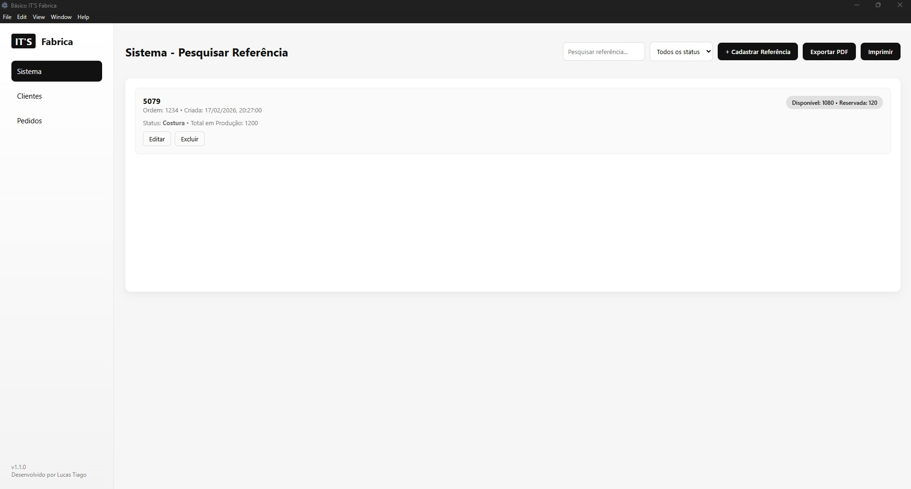
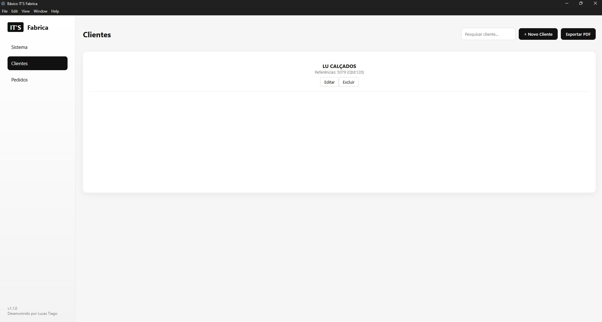
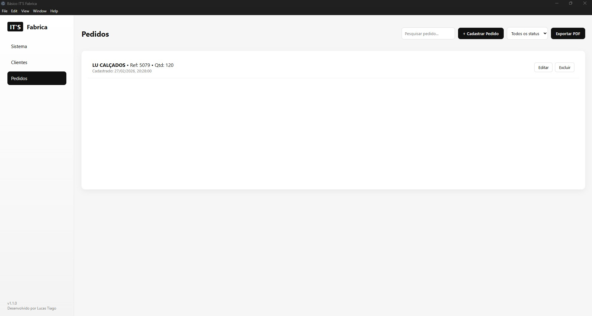

# 🏭 Básico IT'S Fabrica - Gestão de Produção

> **Status do Projeto:** 🚀 Em desenvolvimento (Migrando para Desktop com Electron)

O **Básico IT'S Fabrica** é um software de gestão de produção (ERP) desenvolvido especificamente para o setor de confecção têxtil. O objetivo principal é substituir o uso de planilhas manuais por uma interface intuitiva que controla o ciclo de vida de um produto, desde a criação da referência técnica até a venda final.

---

## 💡 Elevator Pitch

"Este é um software de gestão de produção que controla o ciclo de vida de um produto têxtil. Ele monitora status críticos (corte, costura, acabamento) e calcula o saldo de estoque em tempo real, cruzando dados de produção com pedidos ativos para evitar erros de venda e garantir a integridade da logística."

---

## 🏗️ Arquitetura Técnica

O projeto foi construído seguindo princípios de **Separação de Preocupações (SoC)** e modularização em Vanilla JavaScript:

- **Electron:** Utilizado para transformar a aplicação web em um software desktop nativo.
- **Vanilla JS & LocalStorage:** Foco em performance e simplicidade. A persistência de dados é feita via `localStorage` com tratamento de JSON.
- **Arquitetura de Dados:** Modelagem relacional ligando IDs únicos (`gerarId`) entre Referências, Clientes e Pedidos.
- **CSS Moderno:** Interface responsiva utilizando Variáveis CSS e Flexbox para garantir usabilidade no chão de fábrica.

---

## 📂 Estrutura do Projeto

```text
├── index.html          # Estrutura principal e esqueleto das abas
├── css/
│   └── style.css       # Estilização moderna e responsiva
└── js/
    ├── storage.js      # Coração dos dados (Persistência e Globais)
    ├── sistema.js      # Lógica de produção e referências
    ├── clientes.js     # Gestão de cadastro de clientes
    ├── pedidos.js      # Controle de vendas e reservas
    ├── exportar.js     # Integração com jsPDF para relatórios
    └── main.js         # Maestro: Controle de navegação e inicialização

---

## 📸 Demonstração do Sistema

### Painel de Sistema (Gestão de Referências)


### Gestão de Clientes


### Controle de Pedidos


---